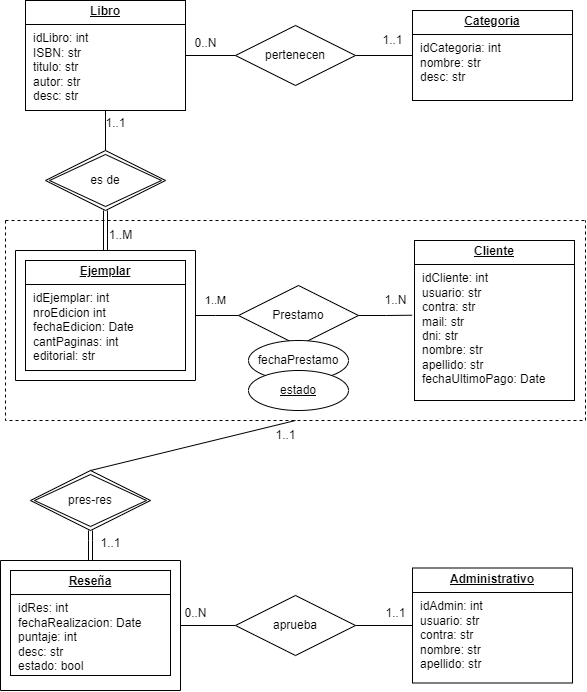

# JAVA-2024--Electiva
Cursado de electiva JAVA 2024
Se incluyen ejercicios y eventualmente el TPI 

# PROPUESTA

## Grupo
### Integrantes
- 49457 - Dorigoni Mauro

### Repositorio
-[Full app](https://github.com/Mauro-Dorigoni/JAVA-2024--Electiva)

### Tema

### Descripcion

Se trata de una simple Biblioteca, donde el cliente podra realizar prestamos de libros por un costo mensual. Los libros disponibles tienen una cantidad determinada de ejemplares fisicos en stock, y pertenecen a una categoria determinada. El cliente no podra realizar un prestamo si el libro deseado no tiene ejemplares en stock, si tiene un prestamo pendiente de devolucion o si adeuda un pago. Eventualmente, luego de la devolucion del libro, el cliente podra dejar una reseña sobre este, que es moderada por un administrador de la Biblioteca.

### Modelo

### Alcance Funcional Regularidad
|Req|Detalle|
|:--------|:--------------------------------------------------------------------------------------------|
|ABMC Simple|ABMC Categoria|
|ABMC Dependiente|1.ABMC Libro {depende de} ABMC Cateogoria   2.ABMC Ejemplar {depende de} ABMC Libro|
|CU No ABMC|Registrar un nuevo prestamo (con todas sus restricciones posibles)|
|Listado Simple|Listado de libros por categoria|
|Listado Complejo|Listado de libros disponibles para prestamo, por categoria, autor, etc.|

### Alcance Funcional AD
|Req|Detalle|
|:--------|:------------------------------------------------------------------------------------------|
|ABMC Simples|1. ABMC Cliente   2. ABMC Administrativo  |
|CU no ABMC|Registrar fecha de ultimo pago de un cliente|
|CU Complejo|Registrar una reseña para un libro de un prestamo devuelto y su moderacion por parte de un administrativo|
|Listado|Clientes con prestamos sin devolver|
|Niveles de Acceso|Usuario/Administrador|

### Implementacion DER Tablas

